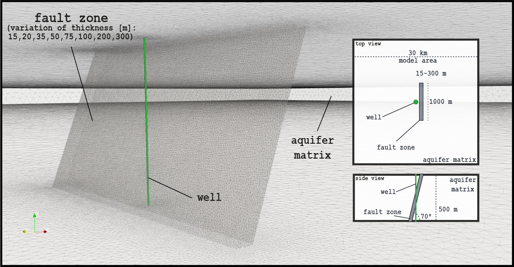

<h1 align="center">
  Upper Jurassic Aquifer Fault Zones
  <br>
  <br>
  uja_faultzones a parametric investigation tool for fault zones and their effect on well productivity
  <br>
</h1>

<h4 align="center">Reduced Basis Model for a single inclined fault zone pierced by a vertical well inside of a porous aquifer - trained on parameter ranges for the Upper Jurassic aquifer of the Northern Alpine Foreland Basin in Souther Germany - based on its typical aquifer geometry</h4>

<p align="center">
  <a href="LICENSE">
    
  </a>
</p>


## About

This Python tool is based on a numerical FE model of a typical fault zone for the Upper Jurassic aquifer in Southern Germany (https://doi.org/10.1186/s40517-019-0137-4). By applying the Reduced Basis method a reduced model was generated which can be used now to calculate the pressure curves of pumping tests of a vertical well inside a 70° inclined fault zone surrounded by an porous aquifer of 500 meter thickness by only supplying the governing hydraulic parameters in a table as `.csv` file. Calculation times are generally below 1 second depending on the computer system.

Focus of uja_faultzones is to simulate two pumping tests for each parameter combination that it is given, one with and one without the fault zone. It then evaluates these pressure curves through the Bourdet Derivative to derive the main flow regime. Next, it compares both in an attempt to calculate the wells relative productivity index improvement through the fault zone. This calculation is only possible if the difference between the two pressure curves becomes numerically stable which depends on the chosen parameters (less than 0.005% value change per hour). Pressure curves can be ouput as `.csv` files as well as plots in various formats.

<p align="center">
    <a href="https://github.com/Florian-Konrad/uja_faultzones/"></a>
</p>

## Licence
uja_faultzones is distributed under the [GNU GENERAL PUBLIC LICENSE v3](https://github.com/Florian-Konrad/uja_faultzones/master/LICENSE).


## Getting Started

#### Minimum System Requirements
* Python 3+
* Git LFS
* Disk: 2 GBs

#### Installation
* Install git (https://github.com/git-guides/install-git)
    and git LFS (https://docs.github.com/en/free-pro-team@latest/github/managing-large-files/installing-git-large-file-storage)

* Clone uja_faultzones:

    ```
    cd ~/
    git clone https://github.com/Florian-Konrad/uja_faultzones.git
    cd ~/uja_faultzones
    git checkout master
    ```

* Install Miniconda3 e.g. Linux Users:

    ```
    curl -L -O https://repo.anaconda.com/miniconda/Miniconda3-latest-Linux-x86_64.sh
    bash Miniconda3-latest-Linux-x86_64.sh -b -p ~/miniconda3
    export PATH=$HOME/miniconda3/bin:$PATH
    ```

* Install Python and Packages:

    ```
    conda env create -n uja_faultzones -f uja_pythonenv.yml
    conda activate uja_faultzones
    ```


## Usage

To use uja_faultzones you need to provide an `.csv` input file containing sets of parameter combinations.
Have a look at `test_input_set.csv` on how to set it up.

Column names must contain: k_matrix, k_fault, viscosity, S_matrix, S_fault, rate
The parameter values must be provided in the following units:
* k_matrix = matrix permeability [m²] (valid range: 1.0e-17 - 2.0e-11)
* k_fault = fault zone permeability [m²] (valid range: 1.0e-14 - 1.0e-9)
* viscosity = fluid viscosity [Pa*s] (valid range: 1.0e-4 - 3.0e-4)
* S_matrix = specific matrix storage [1/Pa] (valid range: 2.0e-12 - 1.6e-10)
* S_fault = specific fault zone storage [1/Pa] (valid range: 2.0e-12 - 1.6e-10)
* rate = production rate applied to well [l/s] (fix to 20, 10 - 20 possible)
* fz_thickness = fault zone thickness [m] (valid discrete values: 20, 35, 50, 75, 100, 200, 300)

Put the `.csv` input file into the same folder as `fz_pi_calc.py`.
Open `fz_pi_calc.py` and provide the `.csv` input file name under USER INPUT.

If you want to output Plots of the derivative analysis as well as the PI alteration calculation for each individual parameter combination set `plotting = True`

If you want to save the pressure information as `.csv` files for each individual parameter combination set `save_pressure_curves = True`

Make sure the `uja_faultzones` python environment is activated.

Run it:

  ```
  cd ~/uja_faultzones
  python fz_pi_calc.py
  ```

Based on the current time stamp a new folder is created which will contain all requested output as well as summary `.csv` file containing the main results for all parameter combinations provided in the input `.csv` file. Its name is `calculated_*yourinputfilename*.csv`

## Cite
